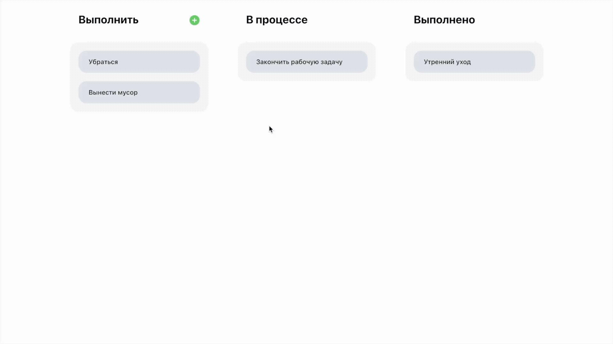

<h1 align="center">
  Vue 3 Task Board
</h1>

<h4 align="center">Task board based on <a href="https://vuejs.org/" target="_blank">Vue</a> and <a href='https://pinia.vuejs.org/'>Pinia</a></h4>
<h4 align="center">Created by frontend developer from Orenburg, Russia — <a href="https://github.com/daniltrunin" target="_blank">Daniil</a></h4>

> [!IMPORTANT]
> — Track created tasks  
> — Add new tasks  
> — Move tasks across the board  
> — Uses the intuitive Pinia store for state management

## You may also like...

- [Vue Weather](https://github.com/daniltrunin/vue-weather) - Weather application made with Vue 3
- [Chatify](https://github.com/daniltrunin/chatify-client) - Real Time Chat Based App
- [Habbit](https://github.com/amitmerchant1990/correo) - Task, Habbits Tracker App

---

> GitHub [@daniltrunin](https://github.com/daniltrunin) &nbsp;&middot;&nbsp;
> Telegram [@shoutoutbelgium](https://t.me/shoutoutbelgium)
